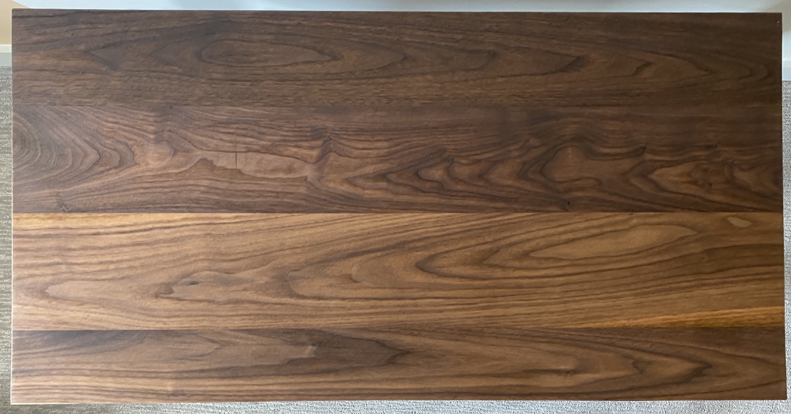
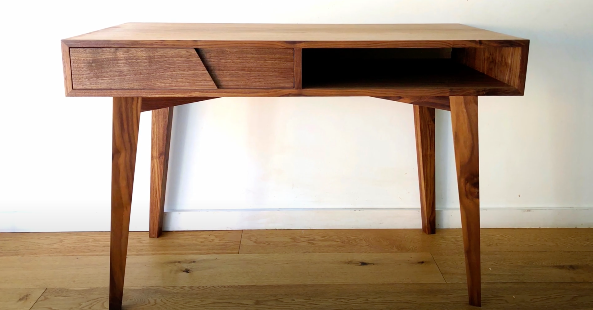
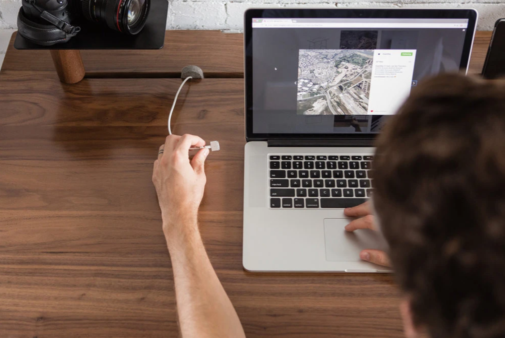
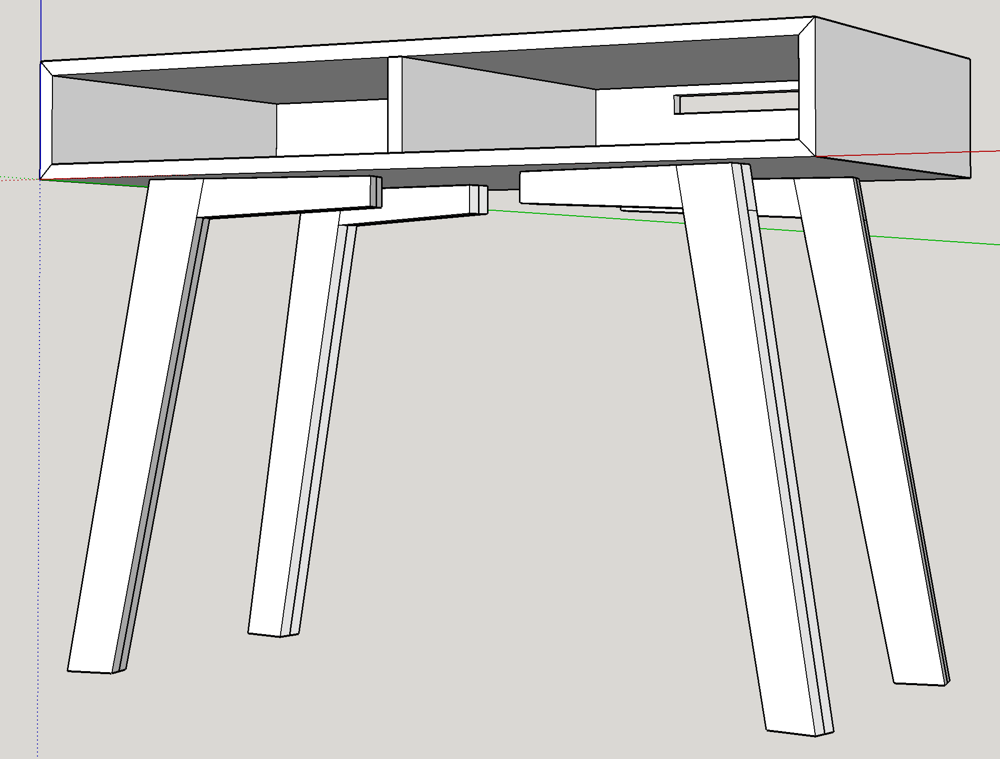
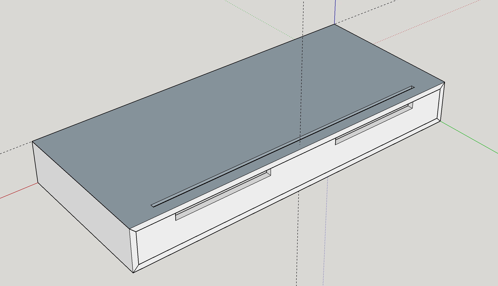
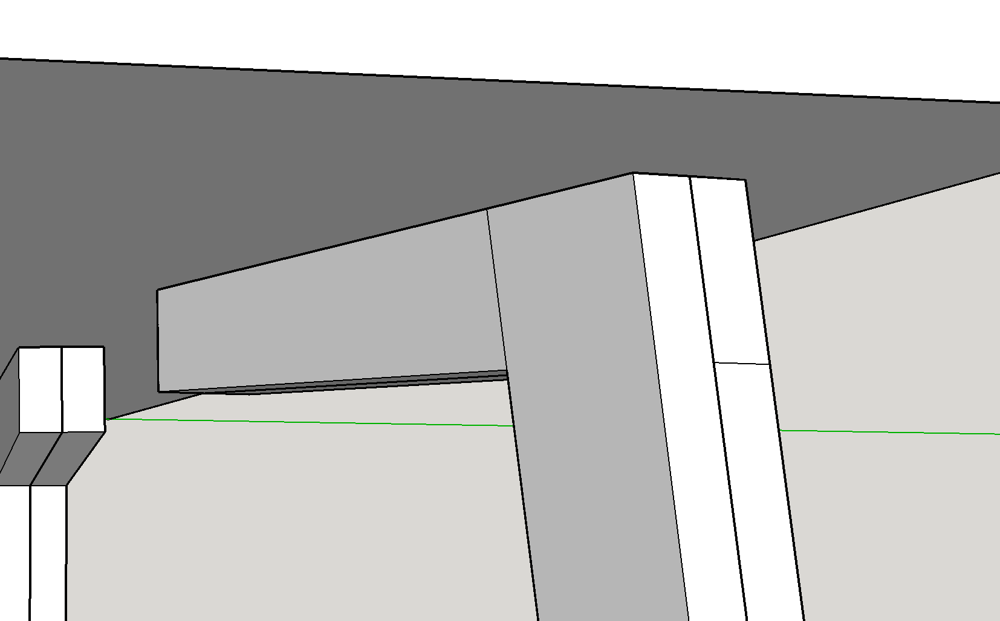
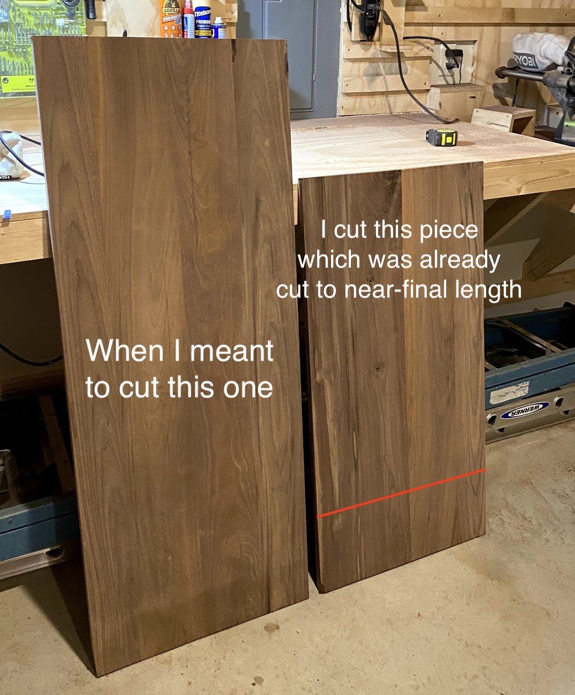
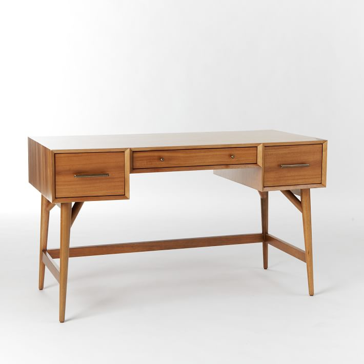
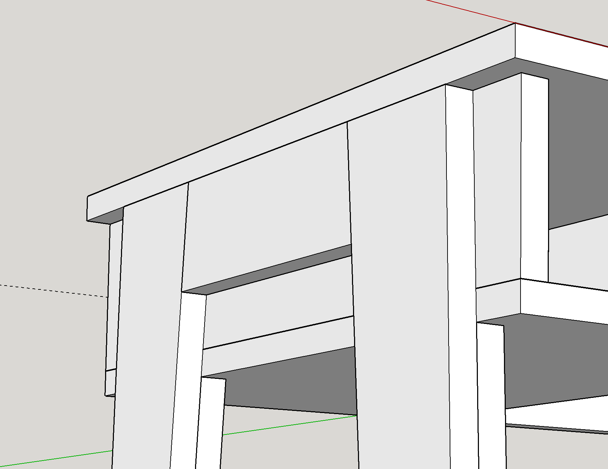

## Design Decisions and Process

This desk was my first build using hardwood. I wanted to build a desk with a beautiful deep color and with some durability to it, so I chose walnut (which I think was a great choice in the end).

This desk was designed to be shallow enough to fit into a closet, whose opening is 52" wide by 22" deep. The dimensions I went with for the final build are 42x21", which kept it from looking too wide, given it's shallow depth.

I started out with a design that was almost exactly copied from a [YouTube video](https://www.youtube.com/watch?v=p7MbUGIS5I8) that I really enjoyed. A midcentury modern design with some beautiful tapered legs and a really cool drawer face design.

My original design also included some cable management solutions to it. I was planning on adding a cable channel on the back of the tabletop, similar to the beautiful multi-use cable channels in the [Artifox Desk](https://theartifox.com/collections/artifacts/products/desk-02-walnut). I loved the idea of being able to pass cables through, but the bottom of the groove also being mostly solid, so you could hold phones or other custom mounts like laptop stands

I was planning on cutting a slot in one or both sides of the back face to pass cables through. My goal here was to mount a power strip inside the back of the desk, allowing for a single cable to actually come out of the back of the desk, keeping the cable management clean!

The legs were the part of this design I was most worried about. I don't own a domino joiner, ans I was a bit concerned about the strength of the leg, given that there wasn't a _ton_ of contact space between the table top and the leg to keep it from shifting side-to-side. To add some more shear strength, I designed the joint connecting the two portions of the leg a half-lap joint.

## Oops...

This was my original design, but I made a critical miscut when I was breaking down the couple large panels I would need to build the tabletop and cabinet box, meaning I couldn't actually _assemble_ the old design without making another trip to the lumber yard.

SO... I had to start from scratch. I wanted to keep the dimensions the same, since I still had a panel glued-up with plenty of extra wood for that.

I love the design of classic midcentury writing desks, and I had plenty of material to make a couple drawer slots, so I adapted my original design to be a bit closer to this design than the original.

I wanted to make sure the drawer slots were wide enough to fit paper at a minimum, so I settled on this design

This design keeps the shape of the previous writing desk, but doesn't use sliding drawers or a middle drawer—just the slots.

The stretcher board on the back keeps the shape of the desk, and assures there will be no issue of weight causing the middle of the top of the desk to warp over time.

The leg design I went with keeps with the taper design from the original design, but with some cool little details. I made sure the drawer slots were inset from the sides by exactly 1 board-width, which left me with a really cool opportunity to double up the legs, since the second leg that was glued to the inside of the main outer legs actually come in under the drawer slots, which I thought was a cool detail.

## Conclusions

I'm really happy with how this desk ended up turning out. It was my first desk design project, and I think it's a good start. It looks a bit clunky honestly, and I'd probably plane the body of the desk down to be thinner (maybe 1/2-3/4"), rather than keeping with the near-1" thickness of the rough lumber that I got, but that's okay.

With thinner material, I could have had more space in the left and right sides to add a drawer or two, but the open cubbies aren't bad either I think.

I decided to not go with any built-in cable management solutions, since I knew the assembly was already going to be complicated without cutting grooves of any kind, but if I were to do it all over again, I probably would add a groove the whole length of the desk, with the left and/or right sides passing all the way through the tabletop into the cubbies, adding a slot to the back of the cubbies, similar to the original design.
