In [my last post](./2020-08-11-desk-01), I walked through how I went about designing and redesigning my latest project, a midcentury-inspired writing desk! In this post, I'm going to be discussing the work that went into actually _building_ the desk.

I drew up designs in SketchUp and rough-estimated how much lumber I was going to need, and went and picked up 7 (I think) pieces of edge-surfaced walnut, each between 8-10ft long.

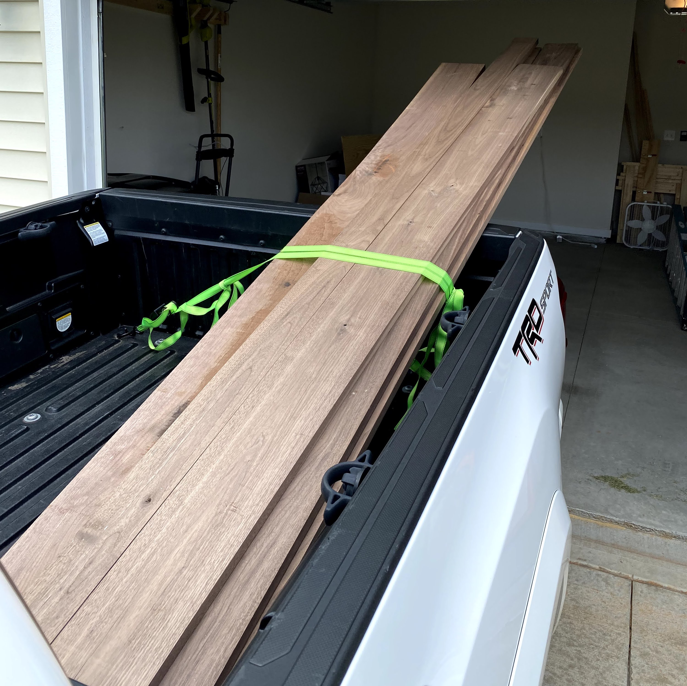

## Preparing the lumber

I figured that I'd need 4 boards laminated together to make up the required 21" depth of the desktop and bottom, so I laid out the wood and figured out what portions I was going to use for each bit. The prettiest, straighted, best edged lengths of wood were chosen to be the tops and sides of the desk (since those would be visible) and the rougher pieces, I chose to use on the bottom.

Sadly, I couldn't get a super consistent color or grain pattern for the top, so I had to settle with 2 lighter and 2 darker colored boards for the desktop (which ended up turning out alright).

Once I had all the boards laid out, I used some painters tape to mark the top pieces and my cut lines. I also numbered all the boards, so I could remember how they were to be laid out and glued up if I mixed any up.

I cut the boards down to rough length (with a couple inches to spare for final cuts later) and laid them out. I saw a cool trick on a youtube video where someone mentioned a "carpenter's triangle" marking on the boards to make them easy to line up later, so I also drew up the triangle on the unglued panels

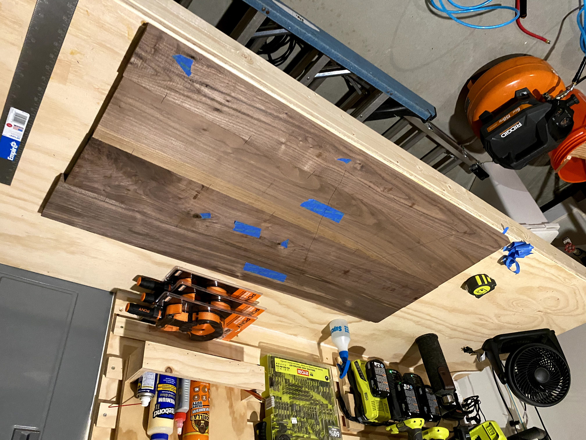

## The Glue-up

I used a biscuit joiner to keep the slightly warped boards straight on glue-up but have no photos of that so you'll just have to take my word for it! I marked spots to cut biscuits on all the boards, cut the holes, and spread out the glue on all the edges.

I used quite a few longer clamps to clamp the boards together, along with a couple cauls (the boards going lengthwise across the panels to keep the panel from warping because of clamp strength). I used packaging tape on the edges of the cauls to make sure the wood glue from the panels wouldn't accidently stick to the cauls.

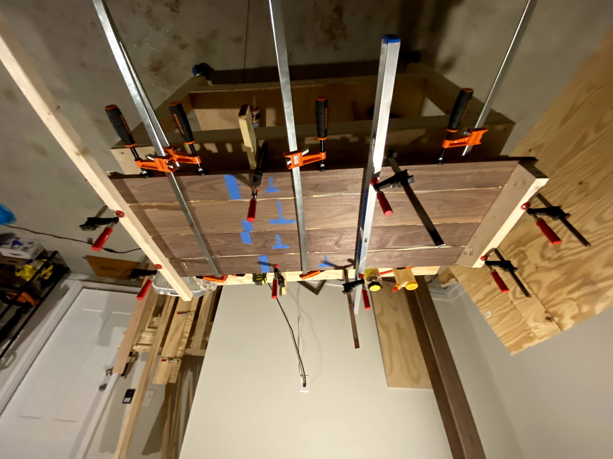

After letting the panels dry overnight, I unclamped them, and they were ready to be planed and cut!

## Surfacing the panels

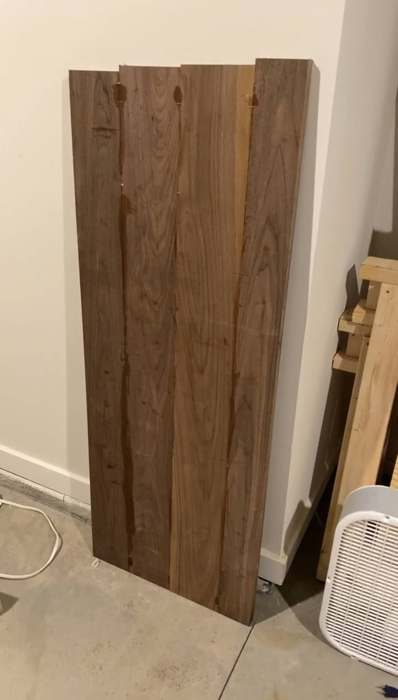

After glue-up, there was a lot of work that needed to be done to the panels. I made no real effort to make sure the boards were the same thickness before glue-up, so the seams on the panels were super visible and rough. I wanted the panel to feel pretty much like a single piece of wood, so I took my electric hand planer and made a couple passes over both sides of each panel to roughly flatten them out.

After planing, I took my orbital sander and sanded the panels with 150 and then 220-grit sandpaper to smooth them out as much as possible. This left the panels looking beautiful and smooth and ready to be cut down to size.

Which leads us to...

## My big mistake

So I originally prepared two large panels: one about 42" long, and another 54" long. The 54" one was supposed to be cut down to a single 42" piece and two 6" pieces that would make up the top and two sides of the desk, along letting the grain of the wood cascade from the top of desk to the sides (called a waterfall). Unfortunately, I didn't realize it until too late, but I cut a 6" piece off the shorter panel, rendering it useless for the design I originally had. I could've shrunk the desk down to 36" and kept going with the original design, but I decided that it would end up too short if I did that.

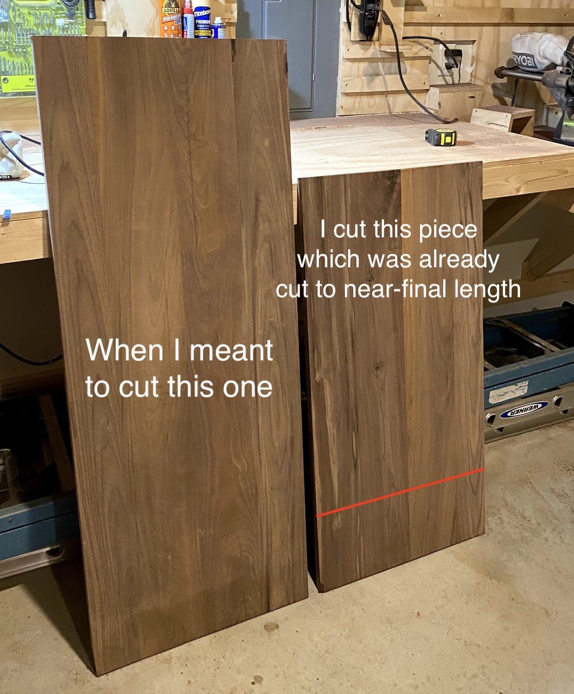

So I went back to the drawing board, and came up with a second design which let me still use both panels.

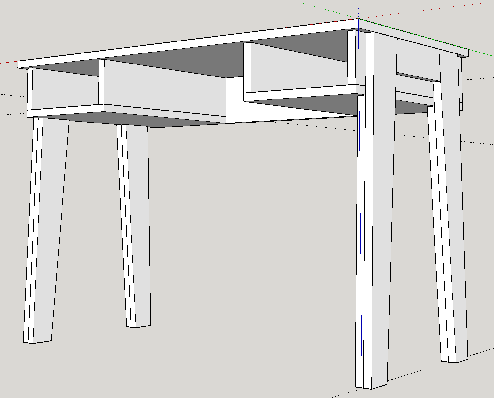

Whenever I cut a lot of pieces at once, I try to draw up my cut list and check things off as I go. I drew up my cut list like below and went to work!

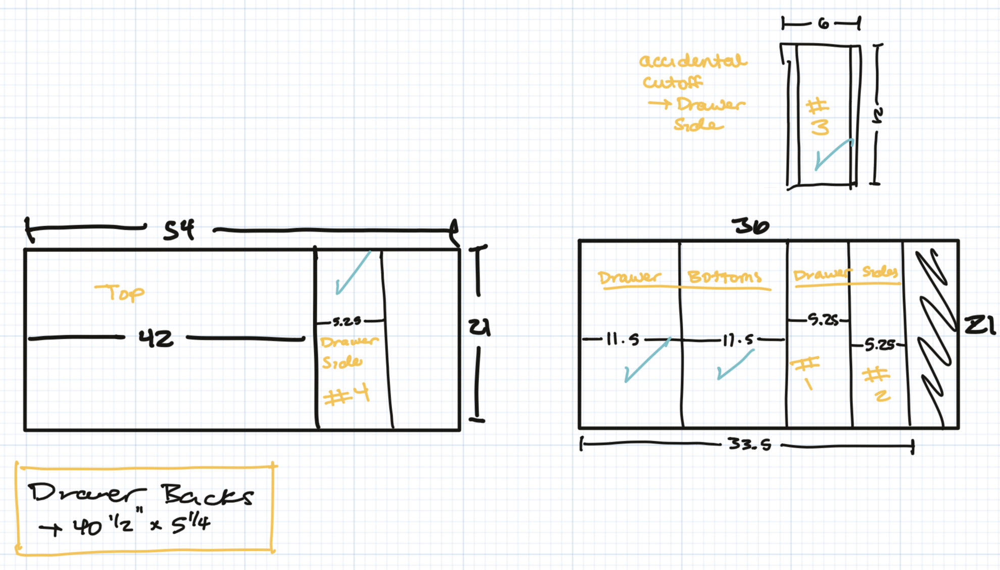

## The drawer slots

Once I had all my pieces cut (aside from the legs... more on those later), it was time to figure out how to assemble the thing. This is something I had been thinking about on background the whole time. There are quite a few pieces, and I wanted to optimize my time and effort when assembling everything.

I figured the assembly would go in this order:

1. Glue up the 3 pieces that made up the drawer slots
2. Glue the drawer slots to the underside of the desktop
3. Glue the drawer slot backboard (the back stretcher)
4. Glue the legs onto the side of the drawers

For the drawer slots, since I cut them with 45-degree angles, it was as simple as folding them into each other, placing a spacer in the opening of the drawer slot, and wrapping a band clamp with 90-degree braces around it. I also added a couple extra clamps to help close up some cracks between the 45-degree mitered cuts.

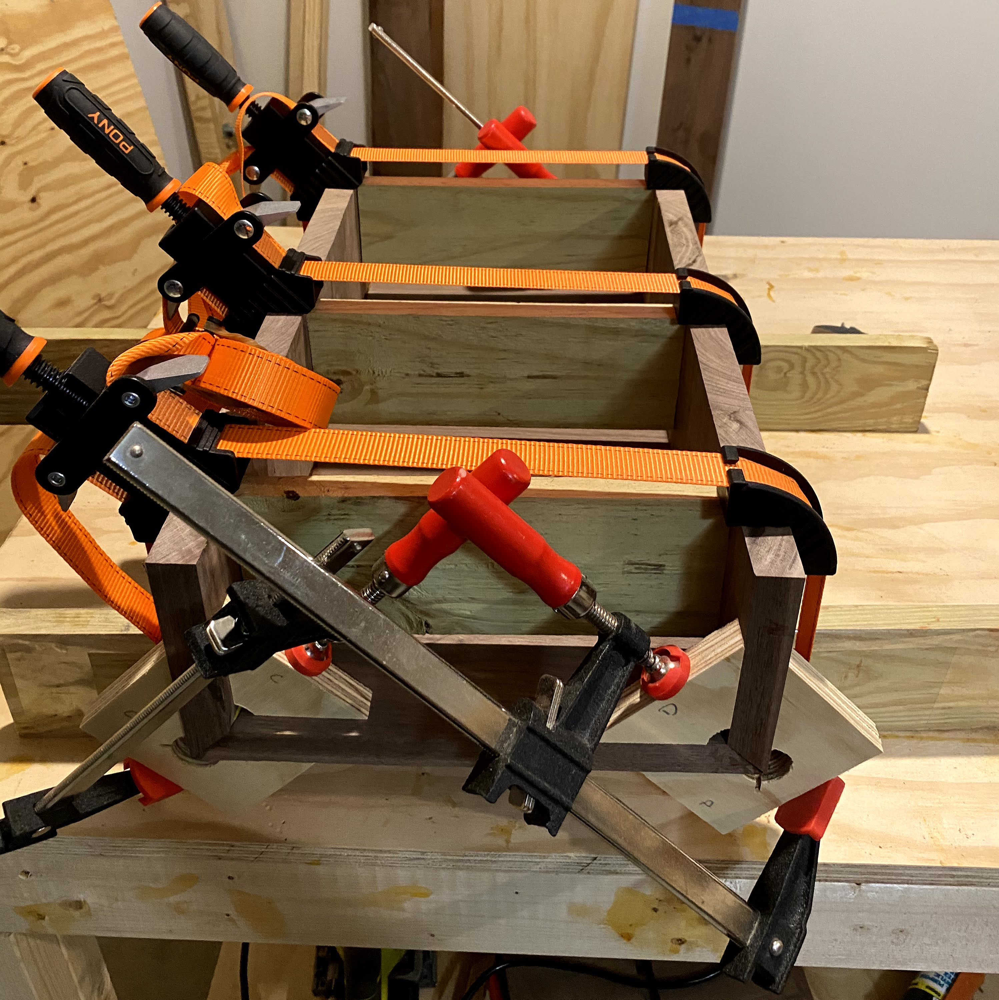
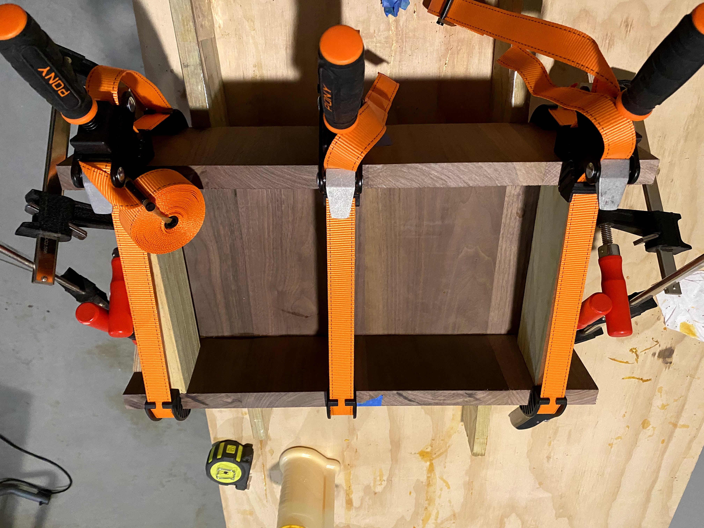

The key to this working was the spacer blocks. Without those, the band clamps would have collapsed the drawers.

Once the boxes were assembled, I could mount them to the underside of the desktop. On the back and sides of the desk, I wanted there to be enough space around the drawer slots to let the back stretcher and legs sit flush with the tabletop. To make this happen, I clamped the backboard and one leg down to the table and then pushed the drawer up against those pieces and glued it down.

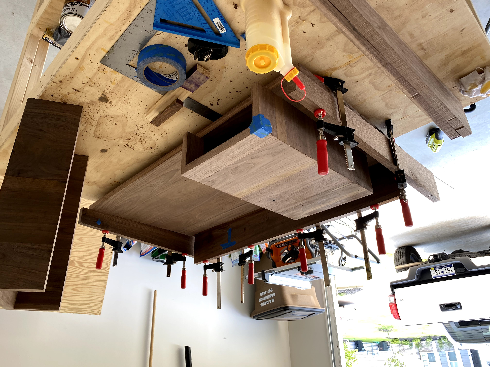
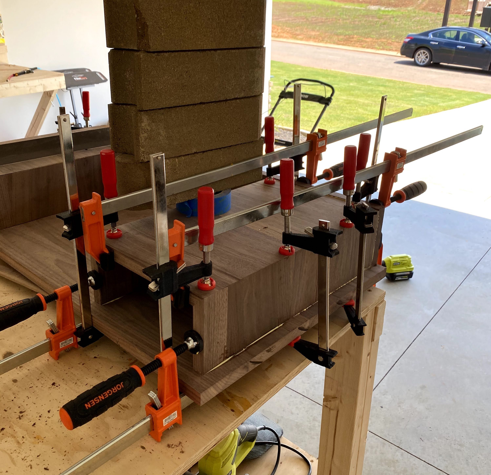

Once I had both drawers in place, I could add the board that would attach to the back of the drawer slots, connecting them and acting as a stretcher to support the desk.

## Legs

The legs of the desk were undoubtedly the most complicated shape to cut out, but they ended up being not too terrible! The basic shape is a taper from 4" at the top to 2.5" at the bottom, with a slight angle on each end of about 5 degrees.

For this, since the cuts are all off-90, I used a plywood template. I measured out everything on a small piece of plywood, and used a [jointing jig](https://www.lumberjocks.com/assets/pictures/projects/451526.jpg) on my table saw to clamp down the plywood strip at an angle and sneak up on the exact perfect cut.

Once I had my plywood template, I took it to a couple rough pieces of walnut and drew out the outline for the legs and cut them a little large on purpose with a jigsaw. After that, I clamped the template to the top of each leg, and took a flush trim router bit around the template to rout the legs down to the exact size I wanted. This actually turned out perfect, and left me with 4 identical legs.

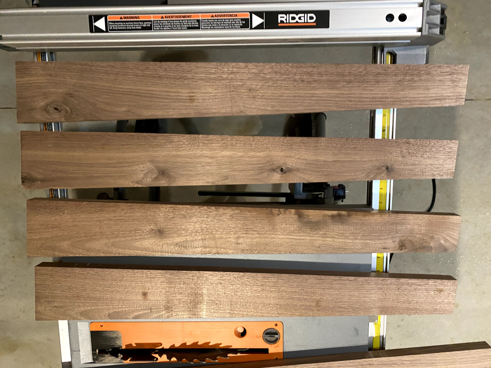

Once I had the legs cut out, the rest was easy. I measured a few inches from the front and back of the desk and clamped the legs in place where they'd end up being glued.

Instead of immediately gluing the legs down, I used this opportunity to measure out the little piece that was going to go between them. I figured it'd be easier to make this piece as close to exact as I could and then glue it in place first, rather than gluing both legs in and trying to fit it in afterwards.

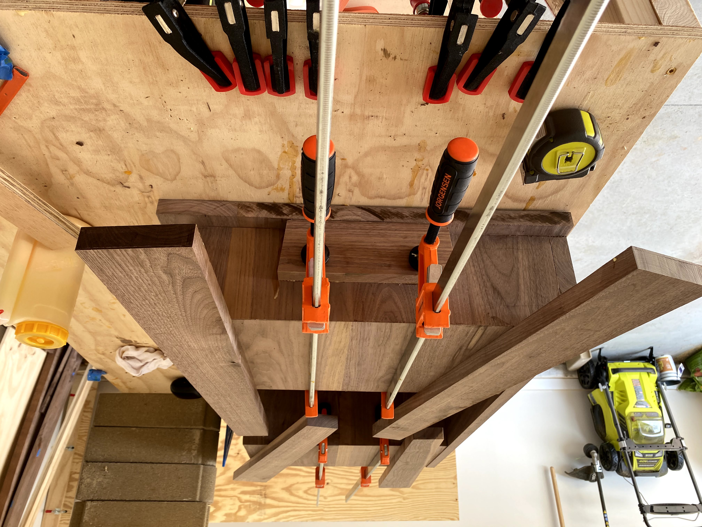

Once the supports on the sides were in place, gluing up the legs was as easy as putting them in place and clamping them down.

Unfortunately, once it was all glued up, there was still a little wobble from side to side when the desk was stood up. I originally had designed the desk with double-width legs, so I decided to actually go with that to fix the wobble.

I trimmed down the original template to make only the bottom portion of the leg, and cut out 4 more half-legs to glue to the inside of the other two. This makes it look like half of the leg is coming out of the drawer box, and honestly adds a bit of nice detail to the final design.

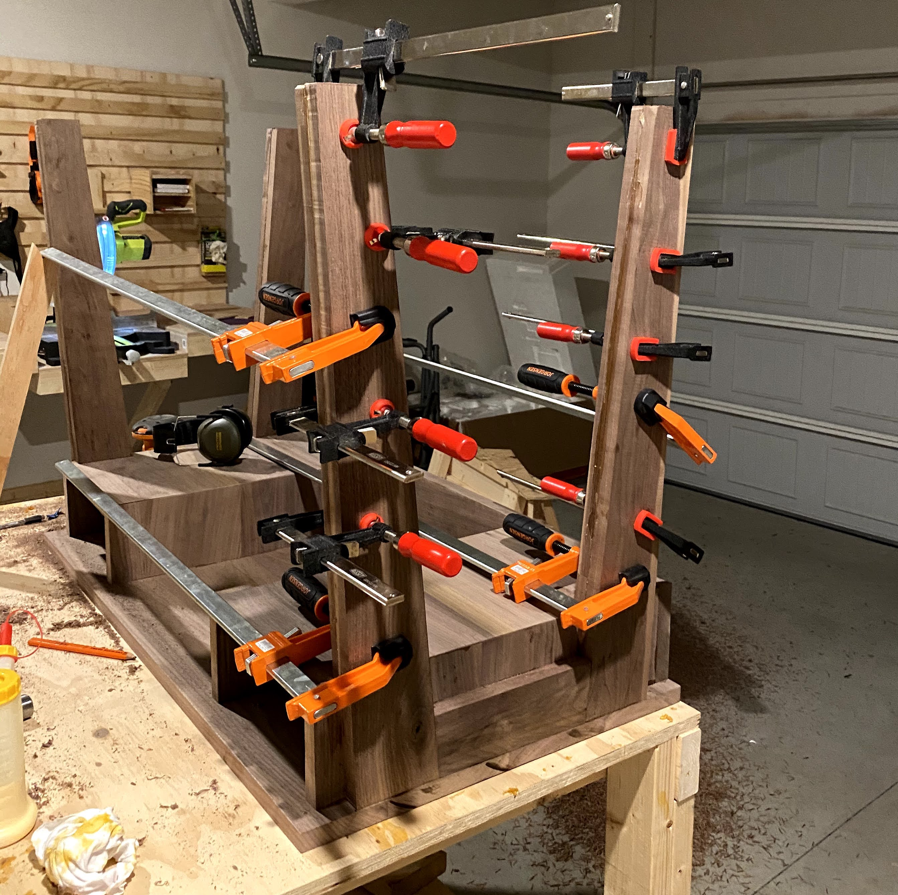
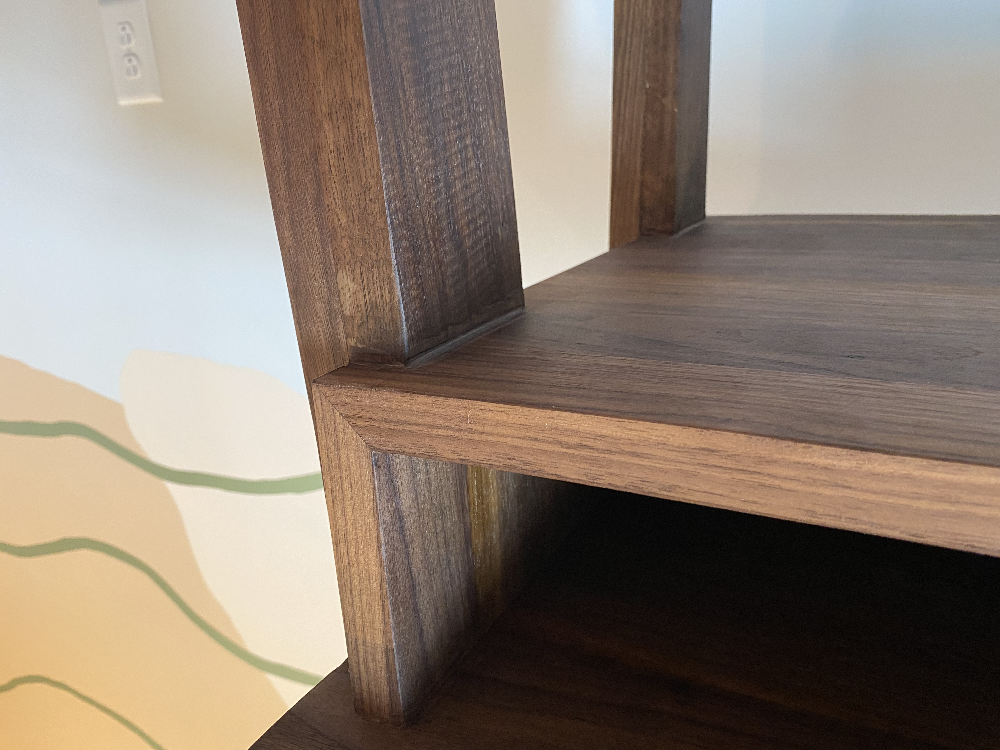

After that, assembly was done! All to do now was fix imperfections and finish everything up!

## Refinement

The biggest problem with the desk as assembled was definitely the gaps in the joinery. Especially in the 45-degree cuts on the boxes, there were imperfections, which left tiny gaps all over the place. Rather than leaving these gaps open, I used a little trick I've seen a few woodworkers on YouTube do.

It turns out that mixing some fine sawdust (like from sanding) with wood glue makes for a really nice wood filler putty. So I mixed up a bunch of it, and went to work. On every joint where there was a gap, I filled it, and around where the legs connected to the box, I even added a slight curve, almost as if they had been caulked.

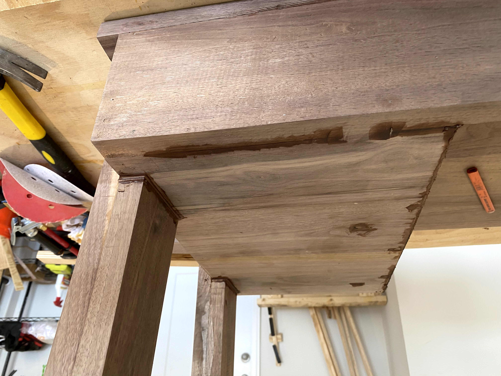
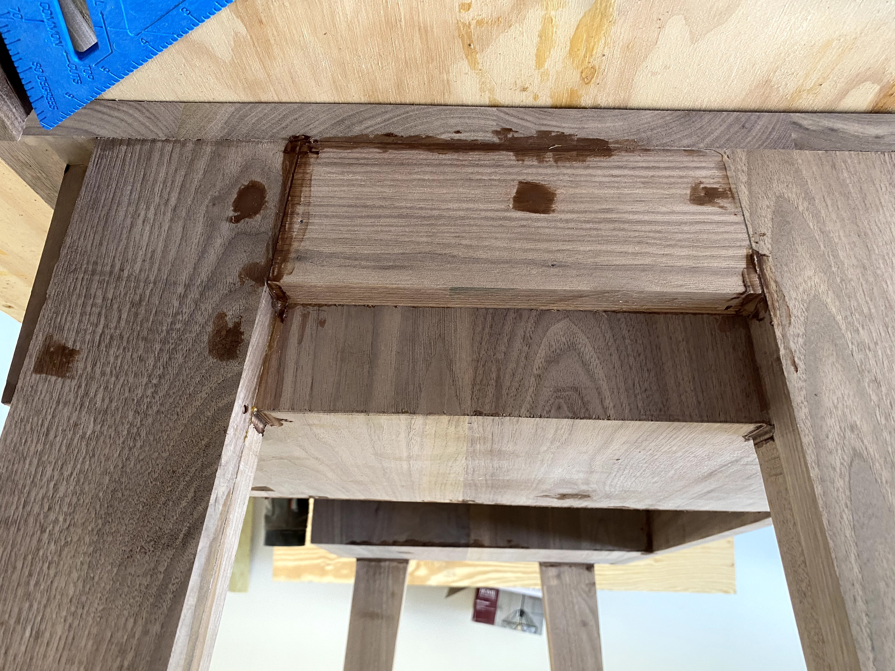

After the filler dried, all it took was a good sanding all around to prep the desk for final finish!

## Finishing

To finish the project, I decided to use an oil-wax based finish from [maker brand](https://makerbrandco.com/collections/simple-finish/products/simple-finish-hardening-finish-with-wax-sealer-for-wood). The oil in this finish brought out a beautiful color in the walnut, and the wax hardens and seals the desk against use and liquids.

Finishing with this is as easy as wiping it on with a rag, applying a second coat in 15 minutes, and wiping off the excess.

After drying for an hour to handle and a day to use, the desk came out absolutely beautifully.

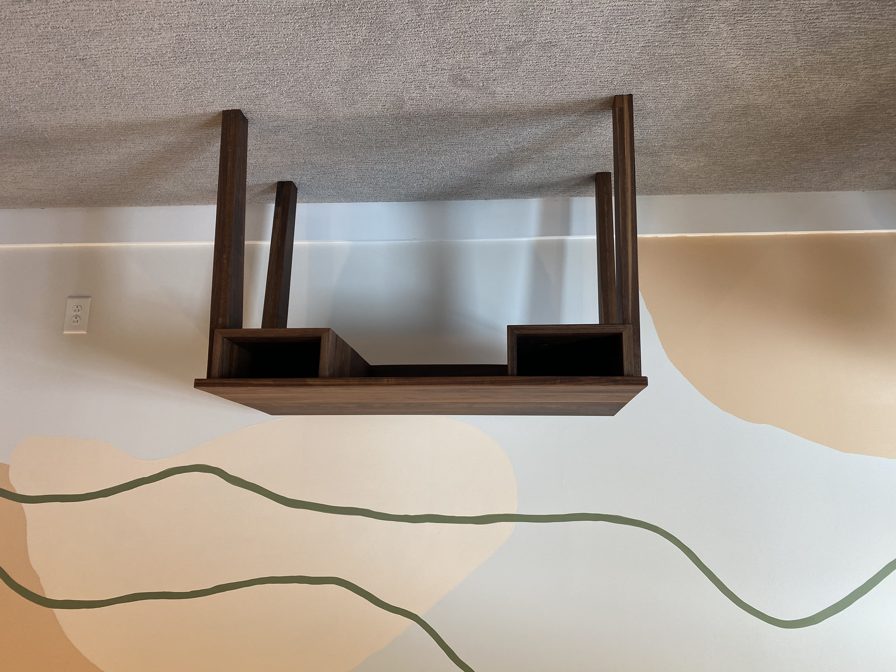
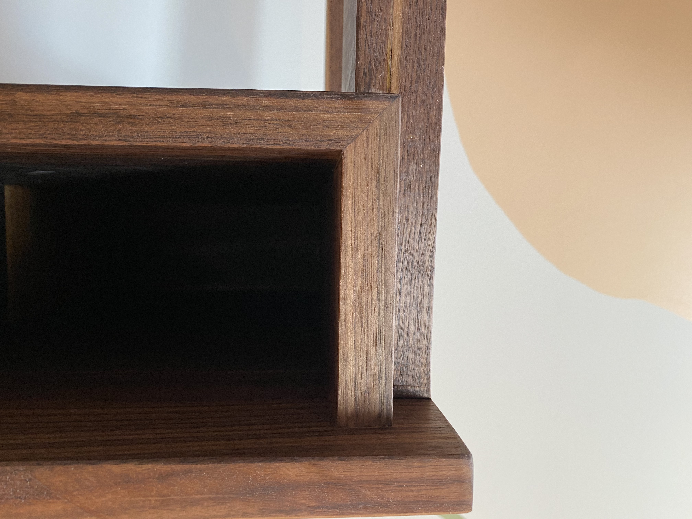

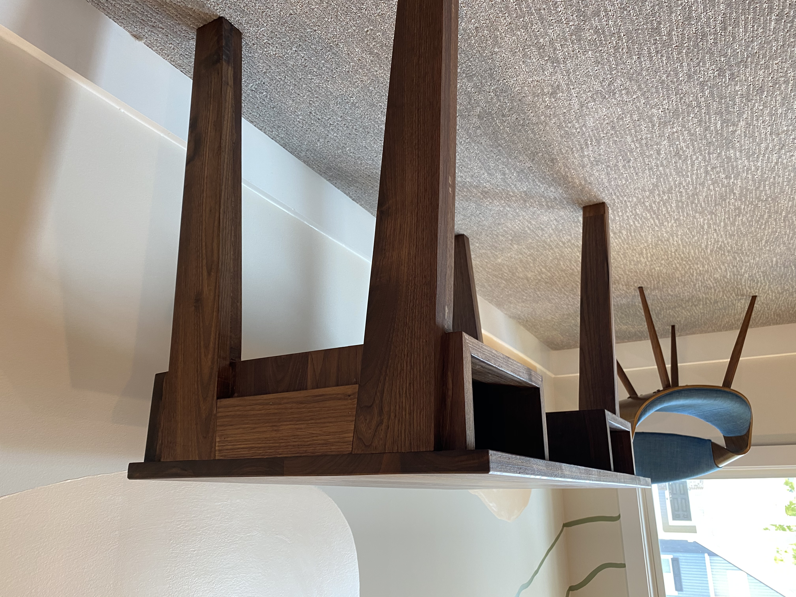

## Lessons learned

All in all, this desk taught me a lot about detail and assembly. I had to work through cutting and clamping awkward angles, fixing imperfections, stability, and practicality (and that's not to mention the major miscut early-on).

1. My mitered 45-degree cuts for the drawer slots were way off. I think when I was running them through the table saw, one edge wasn't straight, and when it moved away from the table saw fence, I added more pressure, bowing the cut inwards. I'll double check all cuts like this in the future, or avoid them with another joint altogether
2. Everything but the desktop in this build ended up looking way too thick. There's no need for drawer slots as thick as they are. While they're sturdy as hell (you could probably run over them at this point), I don't think they look proportional, and I could've milled down the lumber a bit more to fix that (all I had was a hand planer at the time but it still could've worked).
3. Templates and a flush trim router bit are a lifesaver. For complicated pieces, all you have to do is cut it right once, then the rest of the work is easy.
4. An accent color would've made all the difference here. A second kind of wood like maple with a brighter color would have really set the design apart here.
5. Building desks takes a long time, and patience is hard to keep through it all, but the finished product will thank you for taking the extra time to make sure cuts are perfect.
