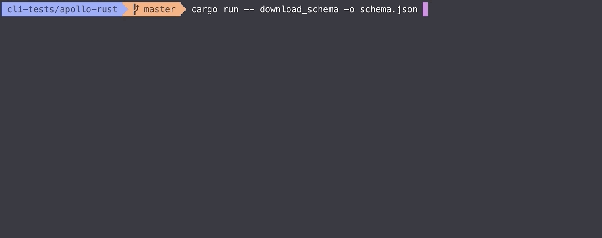
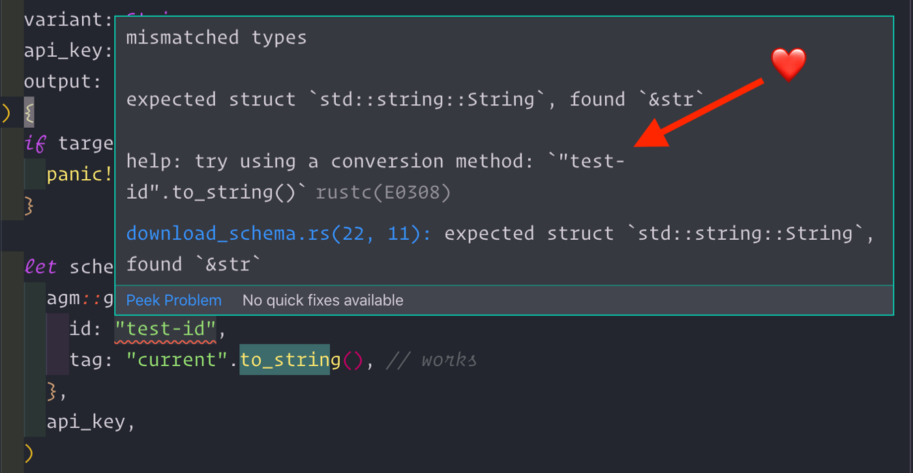
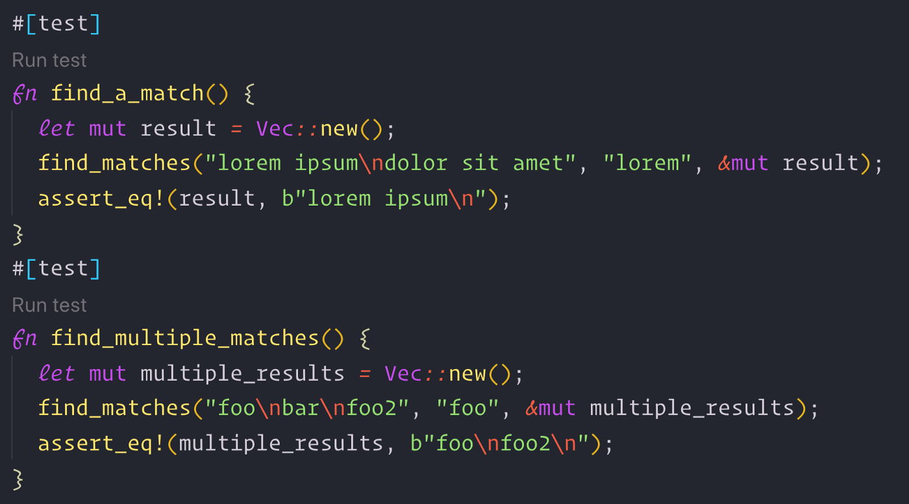
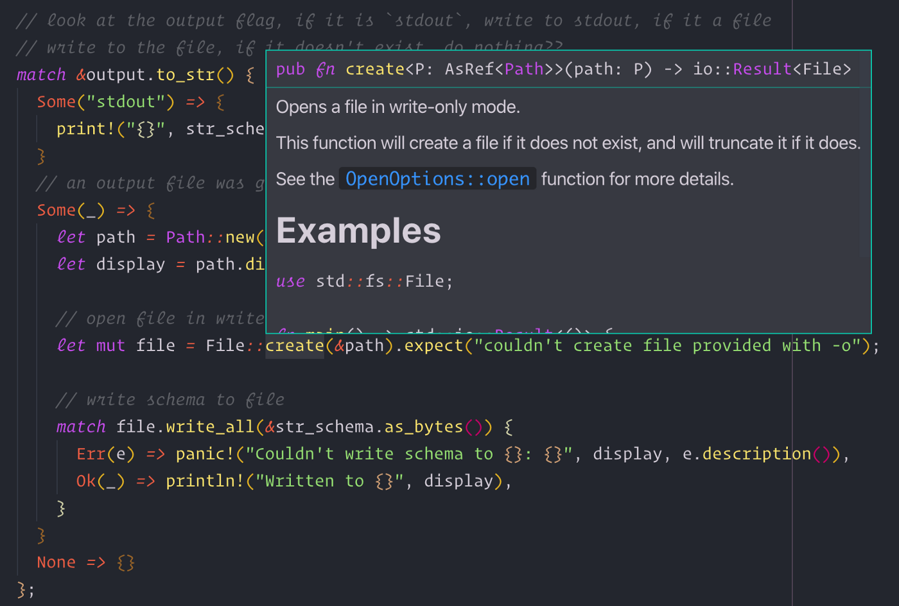
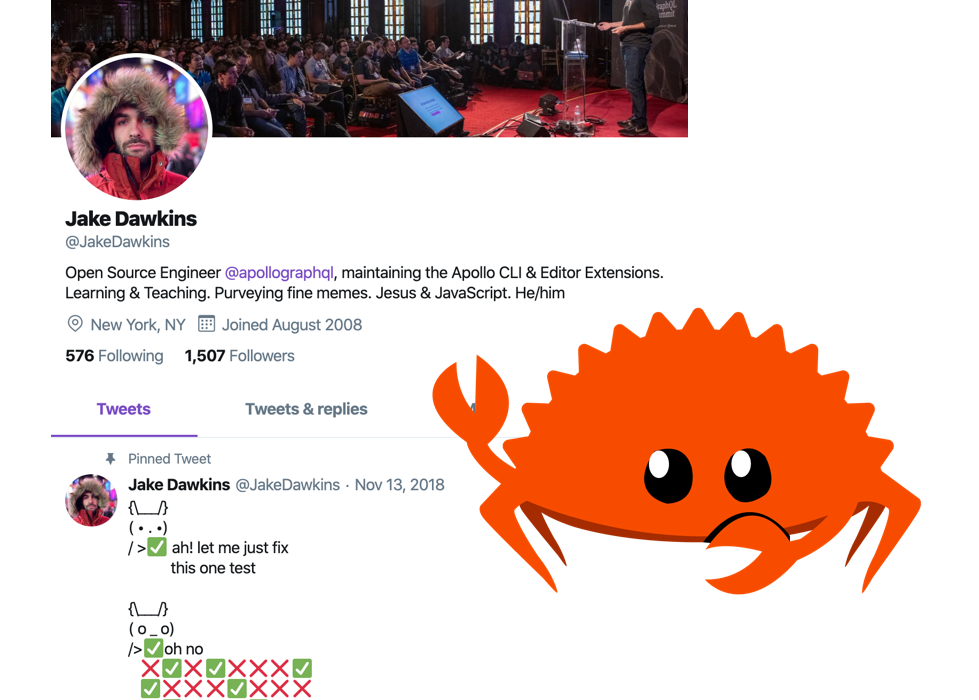

You can probably tell by the title of this article that I’m working on learning Rust. Prior to the past week, I had no experience at all in the language, so it’s very fresh, and it’s been quite an adventure so far. My purpose in learning Rust was originally out of individual interest, but I quickly became interested in its potential for becoming a key portion of [Apollo’s](https://apollographql.com) CLI toolchain. This article is just a brief overview of my experience learning Rust so far, and where I see myself going with it in the future!

## Why Rust

A lot of my work at Apollo revolves around building CLIs. All of Apollo’s open source work is written in TypeScript, so up until now, the [CLI](https://github.com/apollographql/apollo-tooling/tree/master/packages/apollo) and [language server](https://github.com/apollographql/apollo-tooling/tree/master/packages/apollo-language-server) have both been written in TypeScript as well.

The TypeScript ecosystem for building CLIs is useful, but even the most popular CLI frameworks and libraries aren’t as performant as I’d like or very type safe (both of which are extremely important to us). Any by performant, I’m talking not just about CLI boot-up times, but also processing files across very large projects (I’m talking hundreds of thousands of files).

Packaging a CLI tool is also a tricky endeavor. We want our tooling to be usable by any client running any tech stack, especially ones that aren’t using Node. Requiring users to install Node and learn to use NPM to install the CLI is simply not an option moving forward. This issue is one that some frameworks in the JavaScript/TypeScript ecosystem have solutions for, but most of these solutions simply bundle the entire Node execution binary alongside the actual code we want to ship. And since the Node binary is a cool 39MB, this immediately adds a good bit of size to the shipped CLI. That size alone makes the full executable impossible to include in Apollo iOS’s download, meaning it must be downloaded separately. Even simple projects that use CI but not node must set up node and download the Apollo CLI through NPM right now.

Rust handles many of these issues pretty well. Performance is an immediate benefit, as it’s a low-level systems language and it does a lot of work to build in concurrency as a main feature. Packaging a CLI project built in Rust is a bit easier than its node counterpart, as the executables can be built for specific OS’s and architectures in CI tasks (cross-compilation on a single machine turned out to be a battle that I haven’t been able to beat yet). The building of a binary can even be set to exclude the standard library features by default (although I haven’t used that yet in my testing).

All of these benefits are also supported by a lively, growing ecosystem of developers contributing to Rust’s growing popularity and stability. The overlap of communities of JavaScript and Rust is really nice! Many people I follow, work with, and communicate regularly are already working on learning Rust or want to! That’s a **huge** advantage in my mind, and that’s completely ignoring its relationship with WASM and the potential for work on web technologies using Rust.

## My Approach

I’m working through multiple learning resources, but the most useful have definitely been the O’Reilly book, “[Programming Rust](https://www.amazon.com/Programming-Rust-Fast-Systems-Development/dp/1491927283)” and the wonderfully handy “[Command line apps in Rust](https://rust-cli.github.io/book/index.html)” book online. Both of these resources so far have been incredibly helpful!

The command-line ebook has helped me develop and design a good sample project, and the physical book (obviously much more in-depth on the language itself) has been key for understanding code seen in the ebook or code found in other published crates and libraries.

I’ve been working on building a simple proof of concept CLI app that acts as a client to Apollo Graph Manager and lets users download a schema published to the registry. The user can specify what graph they’d like to download, what variant they’d like to use, API keys (as flags and env variables), output destinations (stdout or file paths), and more. So far, it’s been a lot of fun to figure out!I

_It works (running a simple command and downloading a schema to output.json)!_

## Initial takes

I haven’t been engrossed in the language for more than a week, so I’m trying to reserve any serious judgments (good or bad) until I’ve been more acquainted. But that doesn’t mean I don’t have any opinions so far!

Disclaimer: I’m sure many of these thoughts are under-thought, under-educated, and maybe just outright incorrect. But nonetheless, I’m just writing about my experiences so far, not stating truths about the language or ecosystem 😀

### The Language

The language itself seemed simple and familiar at first, but quickly got pretty complicated to understand at a quick glance.

I’m used to working with types in TypeScript, and I learned programming through languages like C, Java, and Objective-C so types as well as memory management isn’t completely foreign to me. The type system in Rust seems really nice to work with, and I think most of the complications I’ve had with it are just my inexperience. For example, working with optional types is still confusing to me. But structs, enums, function types, etc. are coming relatively easily to me.

I’m am, however, still a bit confused about value references, like &str vs std::string::String types and having to use .to_string() on string literals to fix type issues. As I said though, I think that's more a result of not having gone through those sections in the book rather than a something fundamentally difficult to understand. On the bright side, the errors for these kinds of issues are helpful and Google searches have been surprisingly fruitful!

_What a helpful error message after messing up string types!_

[Attributes](https://doc.rust-lang.org/rust-by-example/attribute.html#attributes) have been confusing as well, as there’s not a parallel that I’ve used in other languages. They’re used all over the place, for various purposes. Attributes look like #[this] and if you’re not familiar with them can be pretty strange. I’m excited to learn more about them, what all they can accomplish, and how they work, but for now, I’ll just keep learning them one-by-one as I encounter them. I will admit though, there are a lot of really powerful uses that I’ve come upon so far. Maybe my favorite use of attributes so far is marking functions and modules as tests to be run with cargo test using the #[test] attribute. In the VS Code extension, it even adds a button to run the test immediately within the editor! This attribute makes it really easy to build unit tests right alongside the code it’s testing—I **really** like this.

_Annotating test functions with the test attribute_

### The Tooling

Since I primarily work on developer tooling right now at Apollo, I’m particularly sensitive to the quality of tooling. And so far, I’ve been _mostly_ impressed! Cargo is a breeze to use, and acting as a one-stop-shop for all things Rust (so far) has been really easy to figure out. When I wanted to know how to build my first binary, I didn’t have to Google a thing. I just used the --help flags in Cargo to figure out how to do what I wanted—and it worked!

If there was one thing I wish Cargo did better, it’d have to do with build speeds and convenience of rebuilds. Building projects to run (even in development, using cargo run) takes a little longer than I'd prefer it to. That may be my own fault, and I could be missing something, but running changes to my simple CLI project still consistently takes a few seconds to build, which I wish was quicker. I also wish it was more convenient to build on file saves. It's a common practice for me to save a file, jump over to the CLI, run cargo run ... and wait for the output. I'd really like it if there was a way to build the project on save using a file watcher, making cargo run nearly instantaneous. That may be possible using other tools and libraries already, but I haven’t looked too much into it yet.

In a similar vein, I’ve found the VS Code extension both extremely useful, but also slower than I’d like. Since I’m quite the noob, I make more than my fair share of mistakes. Right now, when I make them though, the VS Code extension takes **5–6 seconds** to update with the changes and show my my errors and warnings, which definitely seems too slow. Are other editors faster than this at updates? Do I have something configured incorrectly? Let me know! Until then, however, I’ll keep enjoying the convenience that I DO get from the VS Code extension, since it’s still super useful!

_The ability to see documentation hover is by itself a really great feature!_

### The Ecosystem

So far, I’ve found so many useful projects that are pretty mature and usable in much more than my little proof-of-concept. The ecosystem of libraries available on [crates.io](http://crates.io) (Rust’s package registry) seems very mature for how young the language is, which is more than a relief when learning, even if it means simply using a project as a reference for how to document and build your own project.

So far, the GraphQL ecosystem in Rust seems a bit underdeveloped. The [graphql-client](https://github.com/graphql-rust/graphql-client) project is useful, but its semantics seem a little confusing, using the #[derive(GraphQLQuery)] and #[graphql] attributes (although it may be proper Rust, so I'm saving judgment there). The [graphql-parser](https://github.com/graphql-rust/graphql-parser) project has been really useful, and the underlying AST created after parsing schemas and operations seems to be mostly correct from my work with it, but that's about it. Other than those projects, I haven't seen any full-featured libraries for working with all GraphQL has to offer (like the reference [graphql-js](https://github.com/graphql/graphql-js) library), but then again, I also know GraphQL quite well and work with some of the world's foremost experts on the matter, so I feel like that's not the worst issue to have, and if nothing else will be a great opportunity for myself to contribute to GraphQL in Rust!

## Conclusions

So far, Rust has had a very steep but welcoming learning curve. The language semantics are a bit strange to me, the tooling isn’t flawless, the graphql ecosystem isn’t fleshed out like I’d prefer yet, but I’m excited to continue learning more! Most of my questions and issues have been solvable through simple searches or doing the hard work myself and reading. And at the end of the day when I inevitably mess things up anyway, the error messages have been pretty helpful!

If you’d like to follow along as I learn more about Rust, follow me on Twitter [@jakedawkins](https://twitter.com/jakedawkins)! If you have any suggestions or comments, tweet at me! I’m pretty friendly 🙂

